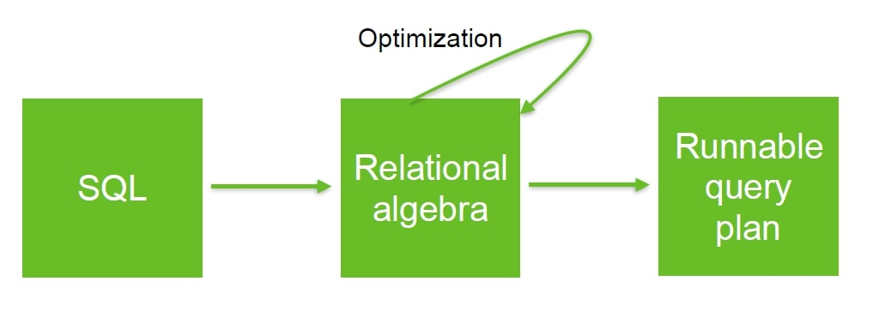
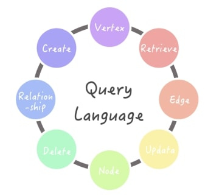
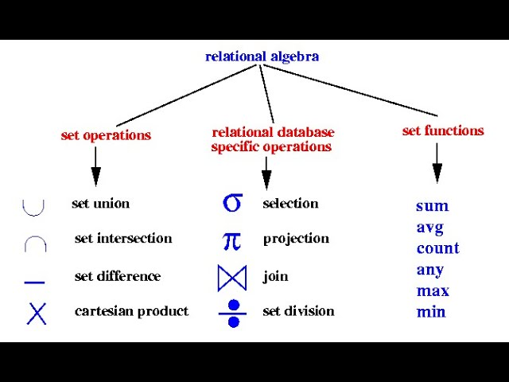
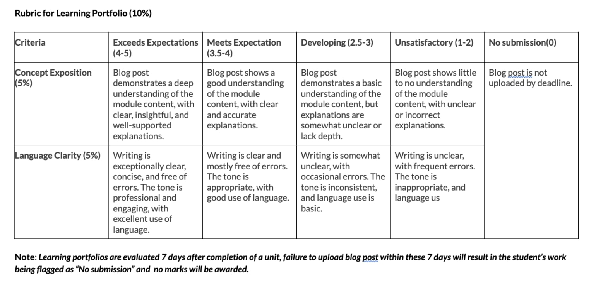
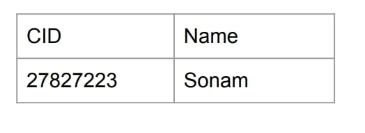
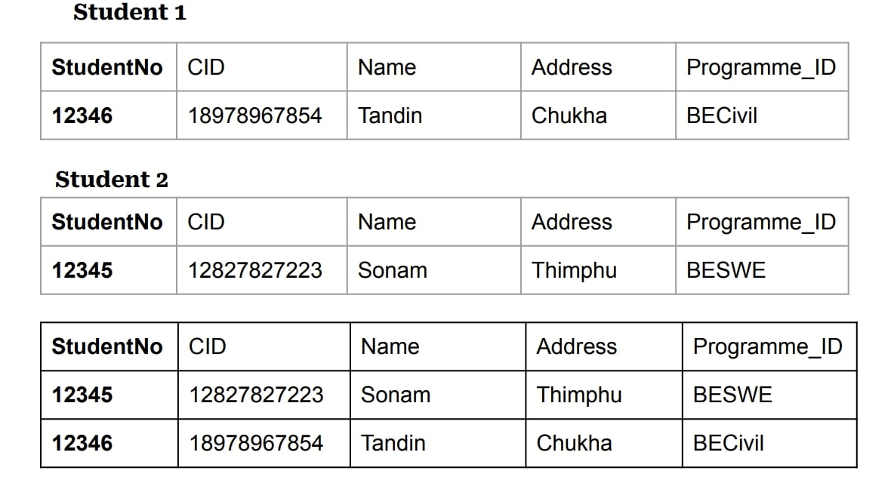
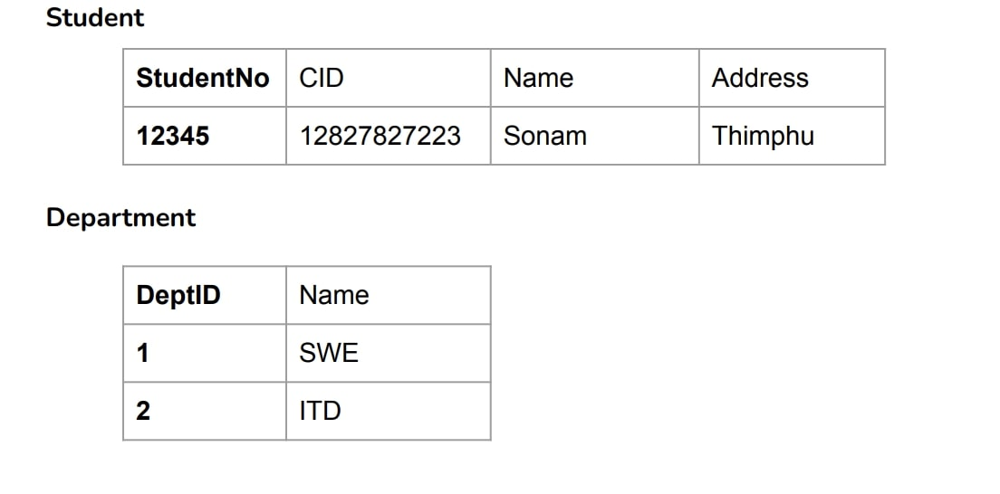

### Relational Query Languages and Relational Algebra: The Mathematical Foundation of Database Systems



## Reflections on Database Systems: Understanding Relational Query Languages

When I first time learned databasde systems, i thought that SQL was the one wand only way to play with database but no i didnt know that beyond SQL lies a powrful foundation called relational algebra. After completing Unit 2 in Database Systems Fundamentals, i have learned a new perspective for how relational query languages and relational algebra from the backbone of modern database systems.



## The Language of Database Interaction

I have learned that a query language is essentially how we users communicate with database to request info. what exicited me was learning that query language has 3 types:

**Imperative Query Languages**:
These needs special instructions on how to get data.Its like giving detailed directions to someone then giving the direct answers.

**Imperative Query Languages**:
This works through function checking on database data. Relational algebra is in this type, giving a framework for database operations.

**Declarative Query Languages**:
This willo allow us users to describe what info others want without specifying how to get it. SQL is a primarily declarative, which explains why it feels more better to use state what we want, and the database system will figures out how to get it.


## Relational Algebra: The Hidden Power Behind SQL


What i truly understand was learning about relational algebra. I now see that SQL statements are important figures into relational algebra expressions for processing. This foundation has several operations such as:



### Main Operations I've learned

#### Select Operation (σ)
This operation will filter rows based on a condition.
```
σstudentNo="12345"(Student)
```
This selects the student with student number "12345" from the Student relation. In SQL, this would be:
```
SELECT * FROM Student WHERE StudentNo = "12345"
```

#### Projection Operation (π)
This operation creates a new relation by selecting specific columns.
```
πCID,Name(σstudentNo="12345"(Student))
```
This retrieves only the CID and Name of the student with student number "12345". In SQL:
```
SELECT CID, Name FROM Student WHERE StudentNo = '12345'
```



#### Union Operation (∪)
This combines tuples from two relations, removing duplicates:
```
Student1 ∪ Student2
```
In SQL
```
(SELECT * FROM Student1) UNION (SELECT * FROM Student2)
```

#### Intersection Operation (∩)
This creates a relation containing only tuples that appear in both input relations:
```plaintext
Student1 ∩ Student2
```
In SQL:
```
(SELECT * FROM Student1) INTERSECT (SELECT * FROM Student2)
```



#### Difference Operation (-)
This creates a relation containing tuples that appear in the first relation but not in the second:
```
Student1 - Student2
```
In SQL:
```
(SELECT * FROM Student1) EXCEPT (SELECT * FROM Student2)
```

#### Cartesian Product (×)
This generates all possible combinations of tuples from two relations:
```plaintext
Student × Department
```
In SQL:
```
SELECT * FROM Student CROSS JOIN Department
```

#### Join Operation (⋈)
This combines the Cartesian product with a selection condition:
```
instructor ⋈instructor.ID=teaches.ID teaches
```
In SQL:
```sql
SELECT * FROM instructor JOIN teaches ON instructor.ID = teaches.ID
```



## The Revelation of Query Optimization
One of the most important concept I gained was understanding how relational algebra helps query optimization. Consider these two equivalent expressions:
```plaintext
σb_id=102(R⋈S) vs. (R⋈(σb_id=102(S))
```
If relation S contains billions of tuples but only one with b_id=102, the second approach is more efficient because it filter S before performing the join. This knowledge has completely changed how I think about writing efficient queries.



## Connecting Theory to Practice
Consider the employee database Give an expression in relational
algebra to express each of the following queries:

- Select all employees who live in the city “Miami”
```
σ(city = 'Miami')(Employee)
```

- Find the name of each employee who lives in city “Miami”.
```
π(name)(σ(city = 'Miami')(Employee))
```

- Find the name of each employee whose salary is greater than
$100000.
```
π(name)(σ(salary > 100000)(Employee))
```

-Find the name of each employee who lives in “Miami” and
whose salary is greater than $100000. 
```
π(name)(σ(city = 'Miami' ∧ salary > 100000)(Employee))
```

## Key Takeaways from Unit 2

**Query Languages Variety**: 
Different query languages have different purposes, with languages like SQL being more user friendly while languages like relational algebra providing theoretical.

**Relational Algebra Operations**:
The main operations (Select, Project, Union, Intersection, Difference, Cartesian Product, and Join) provide a complete undersatnding for querying relational databases.

**Query Optimization**: 
Understanding relational algebra helps us in writing more efficient queries by knowing the order of operations.

**SQL Foundation**: 
SQL is built on the principles of relational algebra, making it a practical implementation of these theoretical concepts.

## Conclusion

My journey thru relational query languages and relational algebra has totally transformed how I see database systems. What I used to think was just simple SQL statements, I now reconize as expressions in a magnificent mathematical language. This profound comprehension will definately make me a more efficacious database user and designer in my future endevors.

The quintessential beauty of relational algebra as the mathematical bedrock for database operations has given me a newfound appreciation for the grandiose discipline of database systems. The juxtaposition of theoretical concepts with practical applications has illuminated my understanding in ways I never thought possible!

As I continue to traverse the labyrinthine pathways of this module, I eagerly anticipate to explore how these foundational theorys apply to more complex database senarios and how they influence the architectural paradigms of modern database system design. The symbiotic relationship between mathematical precision and computational efficiency is truly a testament to the ingenius minds who pioneered this field.
