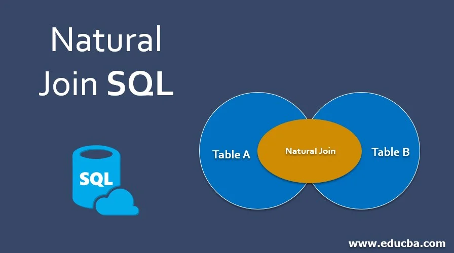

### Title: DBS101 Unit 4 Lesson 9

categories: [DBS101, Unit 4]
tags: [DBS101]

### Topic: Advanced SQL Joins, Views, and Transactions

---

## Introduction

Before this lesson, I only knew some basic SELECT queries. I thought joins just stick tables together. But now I know there's many kinds of joins and each one do diff stuff. The views and transactions part was new for me and kinda cool.

I was bit confused at first, but our teacher explained slowly so I could catch up. I still mix up the joins sometimes, but doing class exercises helped a lot.

## Important Lessons from Unit 4 Lesson 9


### Understanding Different Types of Joins

Joins help us get data from many tables. I used to only use one table, but joins are really useful when you have related tables.

# **Natural Join**: 
This join works when tables have same column name. It joins using that common column.

```sql
SELECT *  
FROM Customers NATURAL JOIN Orders;  
```



# **Inner Join**:
Most common join. It only shows rows that match in both tables.
Here's a example of an inner join I wrote:

```sql
SELECT Orders.OrderID, Customers.CustomerName, Orders.OrderDate
FROM Orders
INNER JOIN Customers ON Orders.CustomerID = Customers.CustomerID;
```

```sql
SELECT Orders.OrderID, Customers.CustomerName, Orders.OrderDate
FROM Orders, Customers
WHERE Orders.CustomerID = Customers.CustomerID;
```
Both queries give the same result, but the INNER JOIN syntax is clearer and more modern.

# **Outer Joins**: 
These are really useful because they keep rows even when there's no match. There are three types:

# **LEFT JOIN**: 
Keeps all from left table. Right table rows show NULL if no match.
For example, to see all patients even if they don't have appointments:

```sql
SELECT *
FROM Patient
LEFT JOIN Appointment ON Patient.PatientID = Appointment.PatientID;
```


# **RIGHT JOIN**:
Opposite of LEFT JOIN.

```sql
SELECT *
FROM Appointment
RIGHT JOIN Patient ON Patient.PatientID = Appointment.PatientID;
```

# **FULL OUTER JOIN**:
Keeps all rows from both tables, with NULLs where no match.

```sql
SELECT *
FROM Patient
FULL OUTER JOIN Appointment ON Patient.PatientID = Appointment.PatientID;
```

### SQL Views: Virtual Tables


Views are like saved queries. They don't store real data, just show data from other tables.

They help with:
-Hiding complex queries
-Only show needed columns
-Easy access to data

Creating a view is pretty easy:
```sql
CREATE VIEW faculty AS 
SELECT ID, name, deptname 
FROM instructor;
```

After creating this view, I can query it just like a regular table:

```sql
SELECT * FROM faculty;
```

I learned about materialized views too, which store real data and are faster, but need updates.


Not all views can be updated. For that, view must be simple, only 1 table, no group by or aggregates.


### SQL Transactions: All or Nothing

Transactions make sure all queries run together or none run at all.

```sql
BEGIN TRANSACTION;  
UPDATE accounts SET balance = balance - 100 WHERE account_id = 1;  
UPDATE accounts SET balance = balance + 100 WHERE account_id = 2;  
COMMIT;  
-- If error, use ROLLBACK 
```

They follow ACID:

-Atomicity
-Consistency
-Isolation
-Durability

I liked the bank example. It helped me understand why transaction is useful.

### Integrity Constraints: Keeping Data Valid


Constraints help keep correct data in tables.

NOT NULL: Can't leave empty

UNIQUE: No duplicate

PRIMARY KEY: Unique + Not null

FOREIGN KEY: Links two tables

CHECK: Check values

DEFAULT: Give default value

```sql
CREATE TABLE student(  
  ID varchar(5),  
  name varchar(20) NOT NULL,  
  deptname varchar(20),  
  totcred numeric(3,0) DEFAULT 0,  
  age integer CHECK (age > 0),  
  email varchar(50) UNIQUE,  
  PRIMARY KEY (ID),  
  FOREIGN KEY (deptname) REFERENCES department(deptname)  
);  
```

### SQL Data Types and Schemas


Learned basic and special types:
- INTEGER, VARCHAR
- DATE, TIME, TIMESTAMP
- CLOB, BLOB

```sql
CREATE TABLE media (  
  id INTEGER PRIMARY KEY,  
  book_review CLOB(10KB),  
  image BLOB(10MB),  
  movie BLOB(2GB)  
); 
``` 
Also used CAST to change data types:

```sql
SELECT CAST(ID AS numeric(5)) AS inst_id  
FROM instructor  
ORDER BY inst_id; 
``` 
You can also make your own types:

```sql
CREATE TYPE Dollars AS numeric(12,2) FINAL;  
Or use domains with conditions:
```
```sql
CREATE DOMAIN PositiveSalary AS numeric(12,2)  
CHECK (VALUE > 0);
```  
Auto ID can be done like this:

```sql
CREATE TABLE employee (  
  ID number(5) GENERATED ALWAYS AS IDENTITY,  
  name varchar(20),  
  PRIMARY KEY (ID)  
); 
``` 
Schemas and catalogs help keep things organised.


## My Experience and Reflections


At first, joins were really confusing. I mixed up LEFT and RIGHT join a lot. I even wasted lot of time in lab cuz I reversed the tables.
Views were easy. Just saved queries. I made one that join 3 tables, very useful. Still don’t fully get materialized views tho.
Transactions made sense after the bank example. Both actions must happen or none. That’s important to keep data correct.
I still forget semicolons or the ON clause sometimes. And user-defined types are still confusing for me.
My friend told me it's normal to make mistakes, even he still does after 2 years of using SQL! That made me feel better lol.

## Conclusion

This lesson really helped me. Now I understand how SQL can do more than just SELECT.

Joins were the most helpful. Now I can work with more than one table. Transactions also feel important, like for real systems.

I want to use these skills in real projects. Maybe build simple system for my dad’s shop. I’ll use views and transactions in it.

Still not perfect, but I’m improving. SQL feels less scary now. Can’t wait to learn about stored procedures and triggers next!
