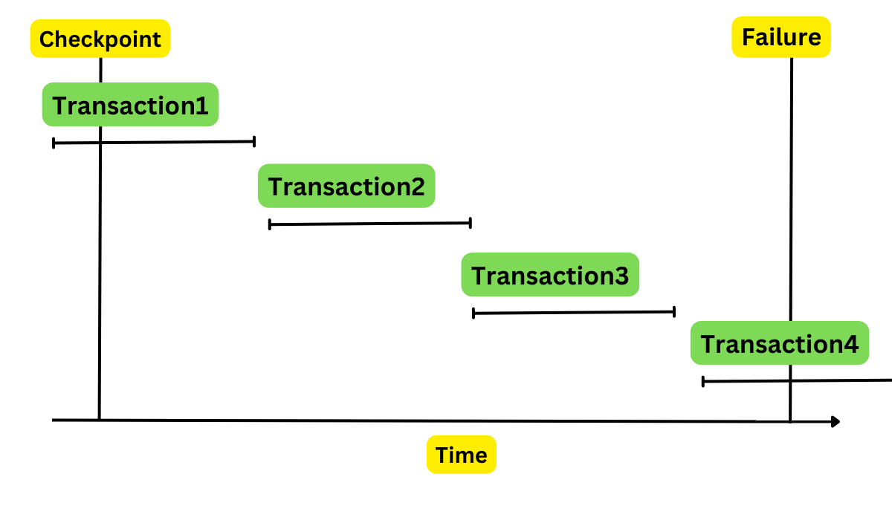

### Title: DBS101 Unit 7

categories: [DBS101, Unit 7]
tags: [DBS101]

### Topic: Database Transactions, Concurrency Control, and Recovery

---

## Introduction

Before learning about Unit 7, I thought databases just stored data and ran queries. I had no idea about all the complicated stuff happening behind the scenes to make sure data stays correct when multiple users are working at the same time or when the system crashes! After going through Unit 7, I now understand that databases use special mechanisms called transactions to make sure operations are reliable, concurrency control to handle multiple users, and recovery systems to protect against failures. What really surprised me was learning about the ACID properties and how important they are for making sure database operations are safe and reliable. The exercises we did in class where we created transactions and saw how locks work helped me understand why these concepts are so important in real-world applications. It's like learning that your bank doesn't just keep your money in a big pile - there's actually a whole system making sure it doesn't get lost or mixed up with someone else's money!

## Important Lessons from Unit 7


### Understanding Database Transactions (Lesson 18)

The first major topic we learned was about database transactions. A transaction is a collection of operations that form a single logical unit of work. In simpler terms, it's a group of database operations that should be treated as one complete task.

For example, when you transfer money from one bank account to another, that involves at least two operations: decreasing the balance in one account and increasing it in another. These operations need to happen together as a single transaction - either both succeed or both fail.

#### ACID Properties

Transactions have four important properties, known as ACID properties:

1. **Atomicity**: Either all operations of the transaction are reflected properly in the database, or none are. This is the "all or nothing" property.
2. **Consistency**: Execution of a transaction preserves the consistency of the database. This means the database remains in a valid state before and after the transaction.
3. **Isolation**: Even though multiple transactions may execute concurrently, it appears to each transaction that others executed either before or after it, but not at the same time.
4. **Durability**: After a transaction completes successfully, the changes it has made to the database persist, even if there are system failures.


#### A Simple Transaction Model

Let's look at a simple transaction that transfers $50 from account A to account B:

```sql
BEGIN;
UPDATE accounts SET balance = balance - 50 WHERE account_name = 'A';
UPDATE accounts SET balance = balance + 50 WHERE account_name = 'B';
COMMIT;
```

This transaction ensures that:

- The consistency property is maintained (the sum of A and B remains unchanged)
- The atomicity property ensures that either both updates happen or neither does
- The durability property ensures that once committed, the changes persist
- The isolation property ensures that other transactions see either the state before or after the transfer, but not in between


#### Transaction States

A transaction can be in one of several states:

1. **Active**: The initial state when the transaction is executing
2. **Partially Committed**: After the final statement has been executed
3. **Failed**: When normal execution can't proceed
4. **Aborted**: After the transaction has been rolled back and the database restored
5. **Committed**: After successful completion


If a transaction fails, it can either be restarted (if the failure was due to some system error) or terminated (if the failure was due to an internal logic error).

### Concurrency Control (Lesson 19)

The second major topic we covered was concurrency control, which deals with the issues that arise when multiple transactions are executed simultaneously.


#### Transaction Isolation and Schedules

When multiple transactions run concurrently, their operations might interleave, potentially leading to inconsistencies. There are two types of schedules:

1. **Serial Schedule**: Transactions are executed one after another, with no overlap.
2. **Non-serial Schedule**: Operations from different transactions are interleaved.


A schedule is **serializable** if its effect on the database is the same as some serial schedule. Serializability is the key to ensuring isolation.


#### Locks

Locks are the most common mechanism used for concurrency control. A lock gives a transaction exclusive or shared access to a data item.

There are two main types of locks:

1. **Shared (S) Lock**: If a transaction has a shared lock on an item, it can read but not write to that item.
2. **Exclusive (X) Lock**: If a transaction has an exclusive lock on an item, it can both read and write to that item.


The compatibility matrix for these locks is:

| Lock Type | Shared (S) | Exclusive (X)
|-----|-----|-----
| Shared (S) | Yes | No
| Exclusive (X) | No | No


This means multiple transactions can hold shared locks simultaneously, but an exclusive lock cannot be granted if any other lock exists.


#### Two-Phase Locking (2PL)

Two-phase locking is a protocol that ensures serializability. It has two phases:

1. **Growing Phase**: A transaction may obtain locks but may not release any lock.
2. **Shrinking Phase**: A transaction may release locks but may not obtain any new locks.


This protocol ensures that once a transaction starts releasing locks, it cannot acquire new ones, which helps prevent certain types of concurrency issues.


#### Deadlocks

A deadlock occurs when two or more transactions are waiting for each other to release locks, resulting in none of them being able to proceed. There are two main approaches to handling deadlocks:

1. **Deadlock Detection**: The system periodically checks for cycles in the "waits-for" graph and resolves them by aborting one or more transactions.
2. **Deadlock Prevention**: The system uses techniques like timestamps to prevent deadlocks from occurring in the first place.


#### Lock Granularities

Locks can be applied at different levels of granularity:

- **Attribute**: Lock a specific column
- **Tuple**: Lock a specific row
- **Page**: Lock a page of data
- **Table**: Lock an entire table
- **Database**: Lock the entire database


Finer granularity (like tuple locks) allows for more concurrency but has higher overhead, while coarser granularity (like table locks) has less overhead but reduces concurrency.


#### Other Concurrency Control Approaches

Besides two-phase locking, we learned about other concurrency control approaches:

1. **Timestamp Ordering**: Uses timestamps to determine the serialization order of transactions.
2. **Optimistic Concurrency Control**: Assumes conflicts are rare and checks for conflicts only at commit time.
3. **Multi-Version Concurrency Control (MVCC)**: Maintains multiple versions of data items to allow readers and writers to proceed without blocking each other.


### Database Recovery (Lesson 20)

The third major topic was database recovery, which deals with restoring the database to a consistent state after a failure.


#### Types of Failures

Various types of failures can occur in a database system:

- Transaction failures (e.g., logical errors, deadlocks)
- System failures (e.g., power outages, hardware failures)
- Media failures (e.g., disk crashes)


Recovery mechanisms are designed to handle these failures and ensure the ACID properties are maintained.

#### Log-Based Recovery

The most common recovery technique is log-based recovery. The database maintains a log of all update operations, which can be used to redo or undo transactions after a failure.

A log record typically contains:

- Transaction identifier
- Data item identifier
- Old value (before update)
- New value (after update)


Other types of log records include:

- `<Ti start>`: Transaction Ti has started
- `<Ti commit>`: Transaction Ti has committed
- `<Ti abort>`: Transaction Ti has aborted


#### Undo and Redo Operations

After a failure, the recovery system needs to:

1. **Undo**: Restore the values of data items updated by incomplete transactions to their old values.
2. **Redo**: Set the values of data items updated by committed transactions to their new values.


The system determines which transactions to undo and which to redo based on the log records.


#### Checkpoints

To limit the amount of log that needs to be processed during recovery, the database system periodically creates checkpoints. A checkpoint records:

- All transactions active at the time of the checkpoint
- All modified data in memory that has not yet been written to disk


After a failure, recovery only needs to start from the most recent checkpoint, not from the beginning of the log.



#### ARIES Recovery Algorithm

ARIES (Algorithm for Recovery and Isolation Exploiting Semantics) is a sophisticated recovery algorithm that uses:

1. **Write-Ahead Logging**: Log records are written to stable storage before the corresponding data changes.
2. **Repeating History During Redo**: The system retraces actions to restore the database to its state before the crash.
3. **Logging Changes During Undo**: Undo actions are logged to ensure they are not repeated if failures occur during recovery.


ARIES recovery happens in three passes:

1. **Analysis**: Determines which transactions to undo and which pages were dirty at the time of the crash.
2. **Redo**: Repeats history to bring the database to its state before the crash.
3. **Undo**: Rolls back incomplete transactions.


#### Remote Backup Systems

For high availability, many database systems use remote backup sites that maintain replicas of the database. If the primary site fails, the backup site can take over operations.

This approach provides protection against disasters that might affect the primary site and ensures continuous operation of the database system.


## My Experience and Reflections

At first, I found transactions really confusing. I kept mixing up the ACID properties and couldnt remember which one was which. During one lab session, I tried to create a transaction that transfered money between accounts, but I forgot to use BEGIN and COMMIT statements, so my changes werent being treated as a single transaction! It took me like 15 minutes to figure out why my code wasnt working properly.

The concurrency control stuff was super hard to understand. All those different types of locks and protocols made my head spin. I kept getting confused about the difference between shared and exclusive locks, and when I should use each one. The deadlock concept was easier to grasp cuz I could visualize it - like when two people are trying to go through a door at the same time and both refuse to move.

The most intresting part for me was learning about how databases recover from crashes. I never thought about what happens when a database system suddenly loses power or crashes. The idea of keeping logs of everything and using them to redo or undo operations was really clever. During our lab, we simulated a crash in the middle of a transaction, and then saw how the recovery system brought everything back to a consistent state. It was like magic!

I still have trouble with some of the more advanced concepts like the ARIES algorithm and timestamp ordering. There are so many steps and details to remember, and I get lost trying to follow all the different cases. During our group project, I was responsible for implementing a simple recovery mechanism, and I spent hours debugging my code because I kept forgeting to write the log records before making changes to the database.

The two-phase locking protocol was also confusing at first. I didnt understand why a transaction couldnt just release locks as soon as it was done with a data item. But after our teacher explained how this could lead to non-serializable schedules, it started to make more sense. I still struggle with identifying when a schedule is serializable or not, though.

Overall, Unit 7 was probably the most challenging unit so far, but also the most eye-opening. It made me realize how much work goes into making databases reliable and consistent, especially when multiple users are involved or when things go wrong.

## Conclusion

Unit 7 has really opened my eyes to how databases handle complex situations like multiple users and system failures. I now understand that its not just about storing and retrieving data, but also about making sure that data stays correct and consistent no matter what happens.

The most valuable thing I learned was definately about transactions and the ACID properties. I now understand why these properties are so important for critical systems like banking or airline reservations. Without atomicity, a money transfer might leave one account debited without crediting the other. Without isolation, one user might see partial results from another users transaction. And without durability, all your work could be lost if the system crashes.

Im excited to use these concepts in future projects. Maybe I'll build a small banking system that uses transactions to ensure money transfers are atomic, or a reservation system that uses locks to prevent double-booking. I could also implement a simple recovery system that uses logs to restore data after a crash.

I still struggle with some of the more advanced topics like serializability testing and the ARIES recovery algorithm. And sometimes I forget the exact rules for two-phase locking or the compatibility matrix for different lock types. But I guess thats normal when your learning something complicated like this.

Database reliability seemed really intimidating at first, but now I see its just about following certain principles and protocols to make sure data stays consistent. Im looking forward to learning more advanced database concepts in the future!